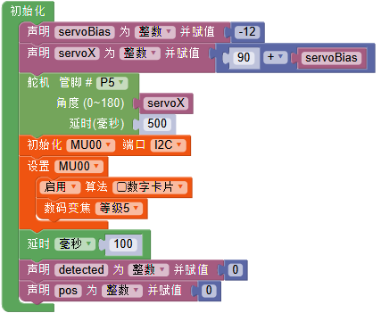
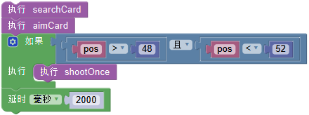
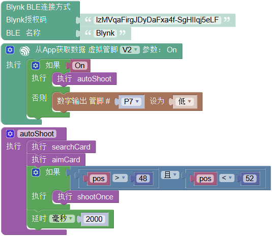

# 自动炮台

## 简介

本项目是改装狄仁杰小车平台制作的自动寻找并射击靶子的炮台。通过安装在炮台前端的MU识别靶子，精确定位其坐标，反馈控制水弹枪射击。

## 自动炮台组成

- 水弹发射器

- 舵机云台

- MU3视觉传感器

- 掌控板+盘古斧

- 聚合物锂电池 + 18650动力锂电池供电

- 改装可被识别的靶子

这个就是我的自动炮台，采用MoonBot的金属钣金制作舵机云台，实现双舵机控制炮台两个自由度的运动。
额外加了一个固定水弹枪体的3D打印支架和固定用的钣金底座。将MU可识别的数字卡片贴在原本的电动靶上，同时还增大了目标更容易射中 囧。。。

## 程序解析

- 初始设置程序

初始化中对将要用到的外设进行设置，包括舵机和MU。

- 寻找卡片函数

寻找卡片采用舵机左右移动的方式，配合上下微调，找寻180度视角范围内的卡片。

- 对准卡片函数

当寻找到卡片时，进入对准卡片的程序。通过舵机移动修正炮和卡片之间的距离。

- 发射函数

比较简单，通过控制P脚直接输出高电平发射，约0.5秒时间，可以打出约3发水弹，如果击倒比较容易则可以时间更短些。

- 循环程序

将以上函数组合后就是循环程序的内容。

- 远程控制程序

另外可以加入Blynk远程开启炮台的程序，将循环程序作为子程序整体放入Blynk中。按键按下则触发循环程序执行自动发射。

## 实战演习

程序开始，舵机复位至正中。主方向为左右方向，检测并扫描。在遇到数字卡片时跳出寻找卡片，进入对准卡片程序。
在确定视觉模块对准坐标48至52位置时射击，两秒后再次进入扫描。

如果加入远程控制程序，则在blynk端按下按键后开启整段自动射击程序。

视频

# 网帖汇总

1. [小MU|小狗狗，认数字-1](http://mc.dfrobot.com.cn/thread-296734-1-1.html)
1. [小MU|小狗狗，认数字-2](http://mc.dfrobot.com.cn/thread-296759-1-1.html)
1. [小MU|小狗狗，做算术-3](http://mc.dfrobot.com.cn/thread-296786-1-1.html#lastpost)
1. [小MU|小狗狗，认颜色-1](http://mc.dfrobot.com.cn/thread-297065-1-1.html)
1. [小MU|小狗狗，认颜色-2](http://mc.dfrobot.com.cn/thread-297085-1-1.html)
1. [小MU|红心献给伟大祖国——朱现伟老师作品](http://mc.dfrobot.com.cn/thread-297706-1-1.html?from=timeline)
1. [小MU|麦小昆：我要发……我要发……](http://mc.dfrobot.com.cn/thread-298548-1-1.html)
1. [小MU|麦小昆：晨练—跑圈圈啰](http://mc.dfrobot.com.cn/thread-298559-1-1.html)
1. [小MU|麦小昆：上学路上](http://mc.dfrobot.com.cn/thread-298563-1-1.html)
1. [小MU|麦小昆：球球走，我也走](http://mc.dfrobot.com.cn/thread-299013-1-1.html)
1. [小MU|狄仁杰机甲的1.5时代](http://mc.dfrobot.com.cn/thread-298663-1-1.html)
1. [自动跟随的麦克纳姆轮小车](http://mc.dfrobot.com.cn/thread-296803-1-1.html)
1. [小MU视觉传感器与麦昆小车的结合——张勇老师作品](https://makelog.dfrobot.com.cn/article-1447.html)
1. [教你如何用Micro:bit做一款迷你“猜数字”游戏机](https://mp.weixin.qq.com/s/DaLSwbE7M0VuTIMr7Dpc2Q)
1. [人工智能（障）|麦昆人体识别与追踪-1——王超老师出品](http://mc.dfrobot.com.cn/thread-296584-1-1.html?from=timeline)
1. [人工智能（障）|麦昆人体识别与追踪-2——王超老师出品](http://mc.dfrobot.com.cn/thread-296843-1-1.html)
1. [麦昆识数字+siot——陈杰老师系列作品](http://mc.dfrobot.com.cn/thread-297504-1-1.html)
1. [麦昆+无人驾驶+siot](http://mc.dfrobot.com.cn/thread-297505-1-1.html)
1. [用MU摄像头做一个图传工程车-1](http://mc.dfrobot.com.cn/thread-299187-1-1.html)
1. [用MU摄像头做一个图传工程车-2|easyiot](http://mc.dfrobot.com.cn/thread-299192-1-1.html)
1. [用MU摄像头做一个图传工程车-3|双头蛇AI+图传+EASYIOT]()
1. [麦昆清障](http://mc.dfrobot.com.cn/thread-297654-1-1.html)
1. [基于视觉识别的智能场馆控制系统](http://mc.dfrobot.com.cn/thread-299363-1-1.html)
1. [小MU与micro:bit互动新玩法](http://mc.dfrobot.com.cn/thread-296610-1-1.html)
1. [国庆花车：麦小昆巡游记](https://makelog.dfrobot.com.cn/article-1884.html)
1. [与祖国同庆 与科技同行|智能麦昆国庆花车——康留元老师作品](https://makelog.dfrobot.com.cn/m_article-1878.html?from=singlemessage)
1. [用小MU中的图传模式做一个智能宠物管家——陶彦辰老师出品](http://mc.dfrobot.com.cn/thread-299509-1-1.html?from=timeline)

## 掌控板板块

1. [[Mind+]掌控板图像识别 - 认数字](https://mp.weixin.qq.com/s/6dRQFztglayCEXV96wzUGQ)
1. [掌控版第三弹：Mind+小MU 看图识数——张玉华老师作品](http://mc.dfrobot.com.cn/thread-296709-1-1.html#pid421784)
1. [掌控慧眼小MU系列教程一|初识小MU](https://makelog.dfrobot.com.cn/article-1746.html)
1. [掌控慧眼小MU系列教程二|颜色识别](https://makelog.dfrobot.com.cn/article-1750.html)
1. [掌控慧眼小MU系列教程三|球体识别](https://makelog.dfrobot.com.cn/article-1752.html)
1. [掌控慧眼小MU系列教程四|形状卡片识别](https://makelog.dfrobot.com.cn/article-1753.html)
1. [掌控慧眼小MU系列教程五|交通卡片识别](https://makelog.dfrobot.com.cn/article-1755.html)
1. [掌控慧眼小MU系列教程六——宽高坐标参数](https://makelog.dfrobot.com.cn/article-1754.html)
1. [掌控慧眼小MU系列教程七——数字卡片识别](https://makelog.dfrobot.com.cn/article-1758.html)
1. [掌控慧眼小MU系列教程八——人体识别](https://makelog.dfrobot.com.cn/article-1759.html)
1. [小MU绘画连连看——康留元老师作品](http://mc.dfrobot.com.cn/thread-297185-1-1.html#pid423122)
1. [小MU|二维码控制的密码“灯”——朱现伟老师作品](http://mc.dfrobot.com.cn/thread-297690-1-1.html)
1. [可以让医生休息的自助视力检测系统](https://mc.dfrobot.com.cn/thread-304089-1-1.html)
1. [小MU掌控板之乘法连连看](http://mc.dfrobot.com.cn/thread-296782-1-1.html)
