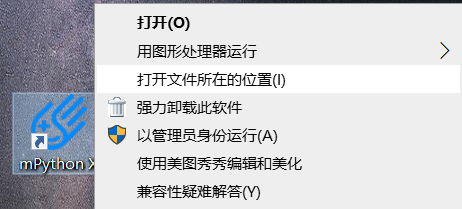
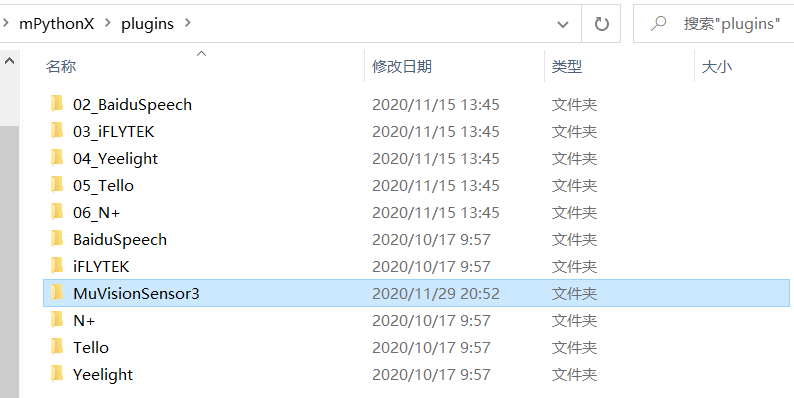
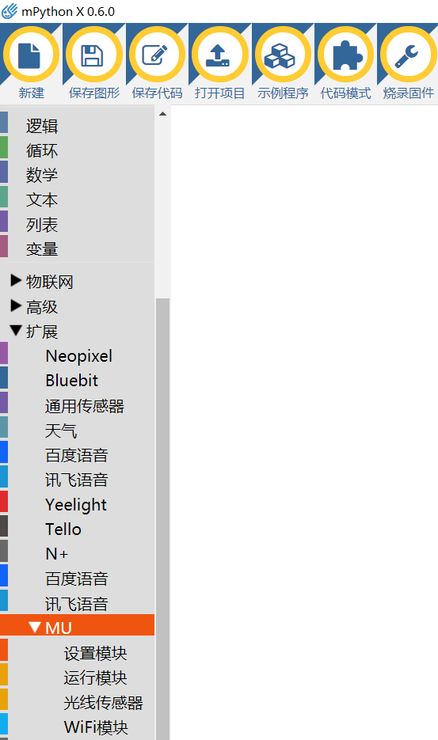
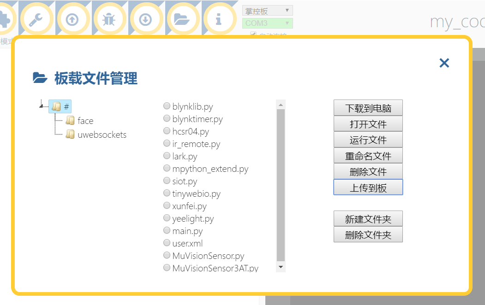

.. Tosee documentation master file, created by ysq.
   You can adapt this file completely to your liking, but it should at least
   contain the root `toctree` directive.

MU-mPythonX 入门教程
====================

    MU-mPythonX 库是专门为 mPythonx 设计的一套图形化库，
    API 全面兼容 Mixly 库，可参考 :doc:`Mixly 教程 <../MUVS3_Mixly/MUVS3_Mixly_Guide>` 。
    本教程旨在指导用户如何在 mpythonx 上安装及使用 MU。

mPythonX 下载/安装
------------------

    最新 mPythonX `下载安装 <https://mpythonx.readthedocs.io/zh_CN/latest/mPythonX.html#id1>`_
    及基础使用教程可参考 mPythonX `官方文档 <https://mpythonx.readthedocs.io/>`_。

图形化库导入
------------

1. 完成 mPythonX 安装后，右键点击 mPythonX 桌面图标，点击 ``打开文件所在位置`` 找到 mPythonX 安装目录。

2. 将库中 ``MuVisionSensor3/`` 文件夹复制到 ``plugins/`` 目录下。 

3. 双击打开 mPythonX 即可在 ``扩展`` 栏看到 MU 的拓展库

MicroPython 库上传
------------------

    图形化库需要基于 MicroPython 库才可运行，点击 mPythonX 上方 ``板载文件管理->上传到板`` 按钮，
    将文件夹 ``MicroPython/`` 下所有文件上传至掌控版。

