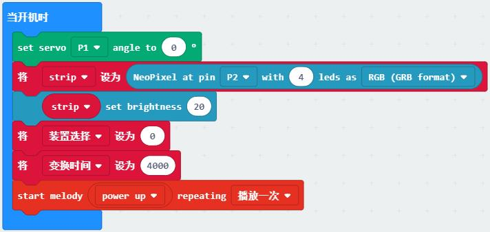
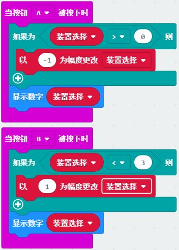
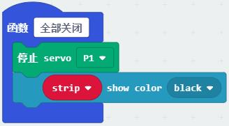
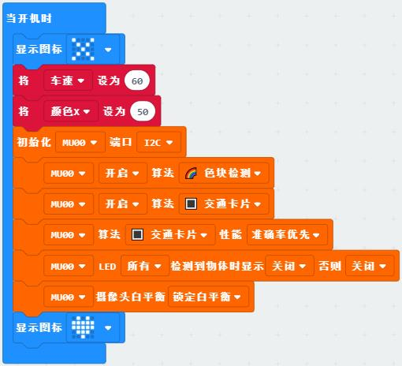
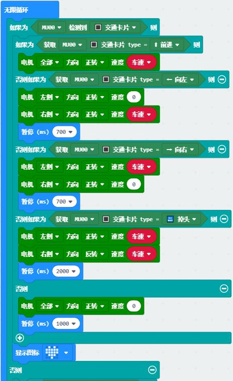
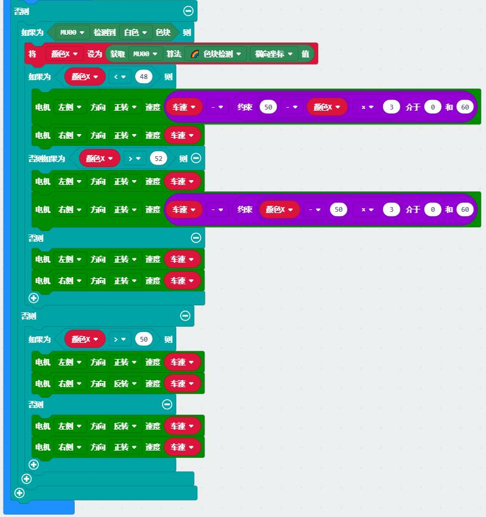
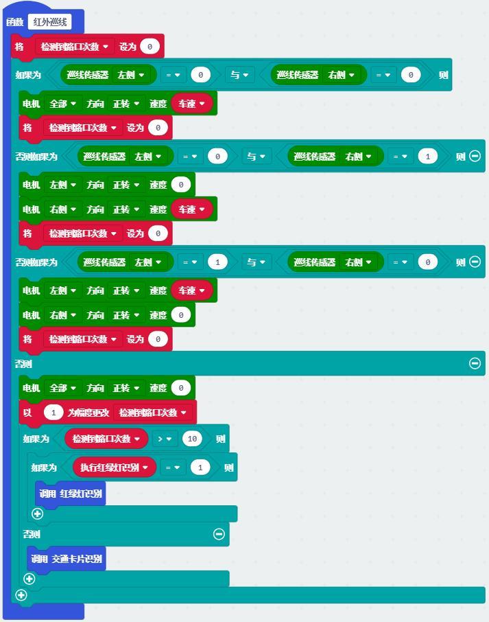
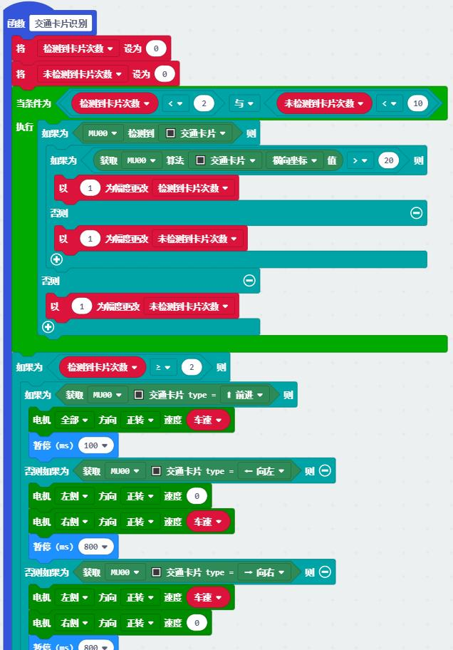
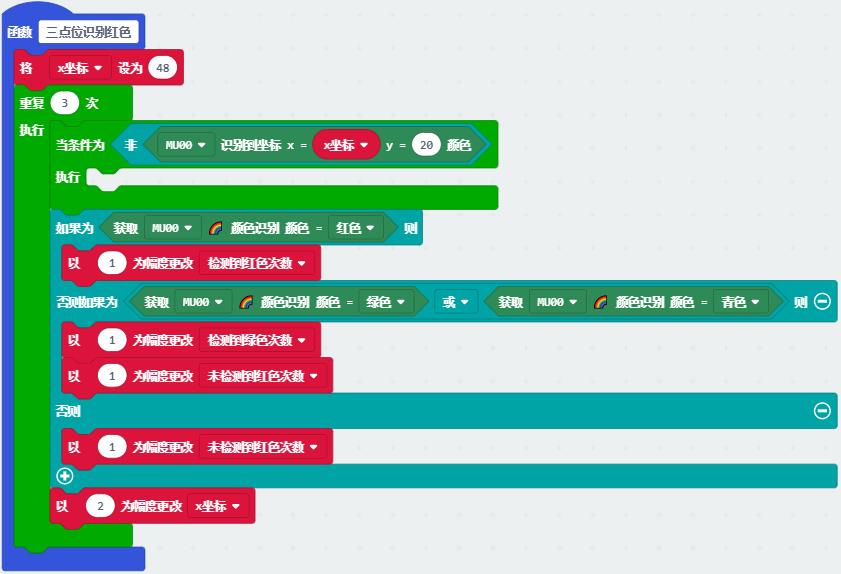

# 综合运用教程

## 交通控制器

交通控制器中micro:bit主控和扩展板作为主控，电池作为供电，舵机和交通灯作为输出，
是舵机、交通灯、GPIO的综运用示例。

下载本页示例：[综合运用程序](https://github.com/mu-opensource/Tosee-docs/raw/master/SelfDriving/SelfDriving_MakeCode/sources/composite.zip)

程序说明：

1.当开机时，设定舵机连接口P1和交通灯连接口P2，初始化用到的变量。

2.无线循环主程序中，检测变量“装置选择”的数值，启用相应功能。

3.通过按键中断对“装置选择”进行修改，且约束在0-3之间。

4.各个功能函数，点亮红绿灯，转动舵机，全部开启和全部关闭，可以被主程序调用。

## 道路内自动驾驶

该应用是用MU识别白色道路和放置在地上的交通卡片引导小车自动驾驶。调节视觉传感器朝向地面。可用模块化地图块拼成道路地图来形成自动驾驶场景。

程序说明：

1.当开机时，设定车速和颜色的坐标，初始化视觉传感器，调整摄像头相关的参数。

2.主程序的第一部分，视觉传感器检测地上是否有交通卡片，并根据卡片类型控制车的动作。

3.主程序的第二部分，当地上没有交通卡片时，检测白色道路的范围，控制小车前进或转弯，使小车始终在白色道路内。

## 单线道路自动驾驶

该应用是红外巡线配合用MU识别前方的交通卡片和红绿灯来引导小车自动驾驶。调节视觉传感器朝向前方。可用模块化地图块拼成道路地图来形成自动驾驶场景。

程序说明：

1.当开机时，设定车速和初始化传感器。主程序就是调用红外巡线。

2.红外巡线子程序中，当小车在路上时，根据道路判断直行或转弯，可参考[红外传感器示例](https://Tosee-docs.readthedocs.io/zh_CN/latest/SelfDriving/SelfDriving_MakeCode/SelfDriving_MakeCode_sensor.html#id6)。

当遇到路口时，判断是红绿灯还是交通卡片，调用相关子程序。

3.在路口首先识别前方交通卡片，根据交通卡片的指示控制车辆转弯或掉头等。

4.当路口未识别到交通卡片时，继续识别红绿灯，开启颜色识别算法，识别三个坐标位置的颜色，判断是红灯还是绿灯。红灯停，绿灯行。

