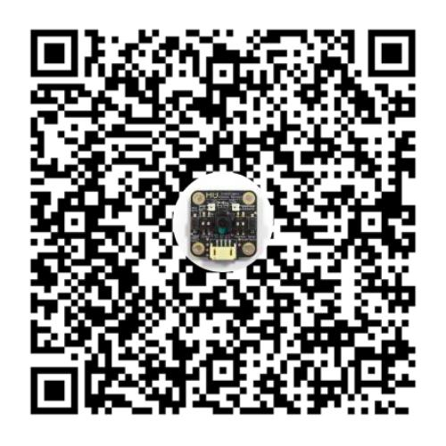
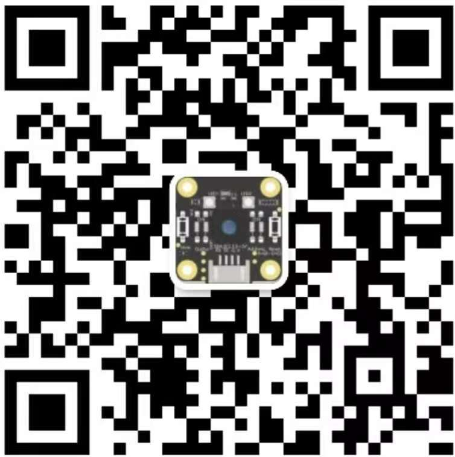

.. Tosee documentation master file, created by ysq.
   You can adapt this file completely to your liking, but it should at least
   contain the root `toctree` directive.

欢迎来到瞳芯智能的文档
======================

+----------------+-+----------------+
|    官方QQ群    | |  微信技术支持  |
+================+=+================+
|     |SPT0|     | |     |SPT1|     |
+----------------+-+----------------+

.. toctree::
    :maxdepth: 1
    :caption: MU Vision Sensor 3 开发教程

    MUVS3/introduction
    MUVS3/MUVS3_Mixly/index
    MUVS3/MUVS3_Arduino/index
    MUVS3/MUVS3_MakeCode/index
    MUVS3/MUVS3_MicroPython/index
    MUVS3/MUVS3_Resource/index
    MUVS3/MUVS3_Application/index
    MUVS3/MUVS3_mPythonx/index

.. .. toctree::
..     :maxdepth: 1
..     :caption: MU无人驾驶教育套件

..     SelfDriving/introduction
..     SelfDriving/SelfDriving_Structure/index
..     SelfDriving/SelfDriving_MakeCode/index
..     SelfDriving/SelfDriving_Resource/index

.. .. toctree::
..     :maxdepth: 1
..     :caption: 技术支持

..     Support/contact
..     Support/about

.. .. toctree::
..     :maxdepth: 1
..     :caption: 版权与许可

..     Copyrights/index_product
..     Copyrights/index_software
